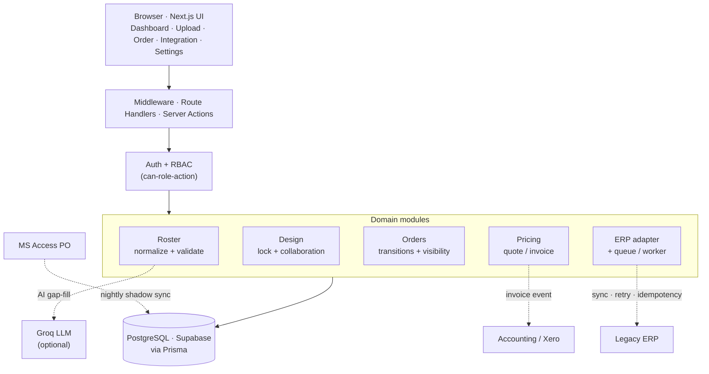
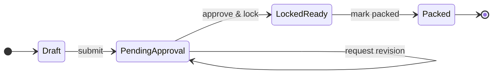
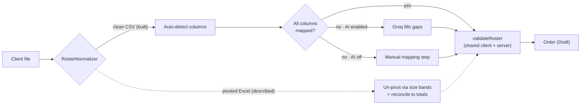
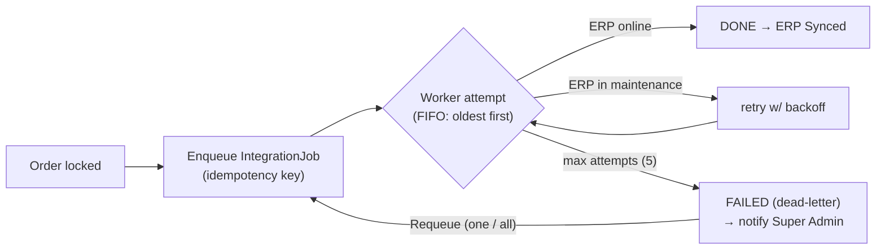

# Architecture

System decomposition + diagrams for the B2B Order Intake & Approval Portal. Mermaid blocks
render on GitHub; screenshot any of them for an "architecture diagram" deliverable.

## System decomposition

A single Next.js app (one repo, one deploy) layered **by domain** rather than by tier, on a
real PostgreSQL database. External systems sit behind adapters so the core never depends on
their protocols.

- **Auth + RBAC** (`lib/auth`, `lib/rbac`, `proxy`) — cookie-backed mock session against
  a real `users` table; a pure `can(role, action)` matrix; the proxy gates pages, API routes
  self-guard and return JSON `401/403`.
- **Roster** (`lib/roster/*`) — a pluggable `RosterNormalizer` (clean-CSV built; pivoted/AI
  variants described), deterministic column auto-detect, optional Groq AI gap-fill, and a
  pure `validateRoster` rules engine.
- **Design** (`lib/design/*`) — a pure `decideDesignAction` state-machine/immutability
  function + a service that persists, audits, and enqueues ERP sync on lock.
- **Orders** (`lib/orders/*`, server actions) — status transitions, role-scoped visibility,
  draft editing, mark-packed.
- **ERP** (`lib/erp/*`) — status mapping, payload builder, mock adapter, and a durable
  queue + worker (retry/backoff, circuit breaker, idempotency).
- **Pricing** (`lib/xero/*`, `lib/catalog`) — catalogue-based quote/invoice with tier
  discount, GST, and deposit.
- **Settings** (`lib/settings`) — ERP-maintenance + AI-assist flags (Super Admin).

### Data model (Prisma / PostgreSQL)

`Club` · `User` · `Product` · `Order` · `RosterEntry` · `DesignLock` · `DesignAsset`
(client reference + designer proof versions) · `DesignComment` · `AuditEvent` ·
`Notification` (in-app, user- or role-targeted) · `IntegrationJob` (ERP queue) ·
`SystemSetting`.

### API surface

- `POST /api/rosters` — parse + validate a CSV (auto-detect/AI mapping, catalogue checks); no
  persistence.
- `POST /api/design-lock` — `lock` / `request_revision`; enforces immutability (`409`).
- Mutations as **server actions** (RBAC-checked, server re-validated): submit roster, submit
  for approval, edit/delete draft, upload reference/proof, comment, request revision, mark
  packed, process ERP queue, toggle settings.
- `GET /api/dev-login` — **dev-only** test aid (404 in production).

## Component & integration view

Solid = built and live; dotted = adapters to systems the business doesn't own (described /
stubbed). External nodes (Groq, Legacy ERP, Accounting, MS Access) hang off the one domain
module that talks to them.

## Order lifecycle (state machine)

`request revision` keeps the order in **Pending Approval** (the designer uploads a new
proof). Once in **Locked / Ready** the order is **immutable** — any edit attempt returns
`409`; that's a constraint of the state, not a transition.

### Mapping to the legacy ERP statuses

The portal runs a lean state machine and **maps** it onto the legacy ERP's richer statuses
through the adapter (rather than reimplementing all of them in the portal):

| Portal status | Legacy ERP status |
|---|---|
| Draft | Not Synced (Draft) |
| Pending Approval | Awaiting Design Approval |
| Locked / Ready | ERP Sync Pending |
| Packed & Invoiced | Packed / Invoiced |

On **lock**, an idempotent job is enqueued and the mapped sales-order payload is delivered by
the worker (preview available per order).

## Roster ingestion (two layers)

Solid = built; dotted = described/stubbed extension points.

## ERP resilience (queue + worker)

A maintenance toggle simulates ERP downtime (acts as a circuit breaker — fail fast). Jobs
wait safely and retry; the idempotency key prevents duplicate ERP orders.

**Processing order.** The worker drains **PENDING jobs oldest-first (FIFO)** so syncs are fair
and nothing starves. Jobs are independent and idempotent, so in production this is the point
you'd parallelise with a bounded worker pool (`FOR UPDATE SKIP LOCKED`) — concurrency capped to
protect the legacy ERP rather than ordering.

**Dead-letter recovery.** After `maxAttempts` (5) a job is dead-lettered to **FAILED** and the
**Super Admin is notified**. From the Integration console they review the dead-letter table and
**Requeue** a single job or **Requeue all** (the usual case — a maintenance window fails many
jobs together). Requeue resets the job to PENDING with a clean attempt count but does **not**
auto-process; the admin runs the queue once the ERP is confirmed back online. The idempotency
key makes requeue-and-reprocess safe (no duplicate ERP order).
